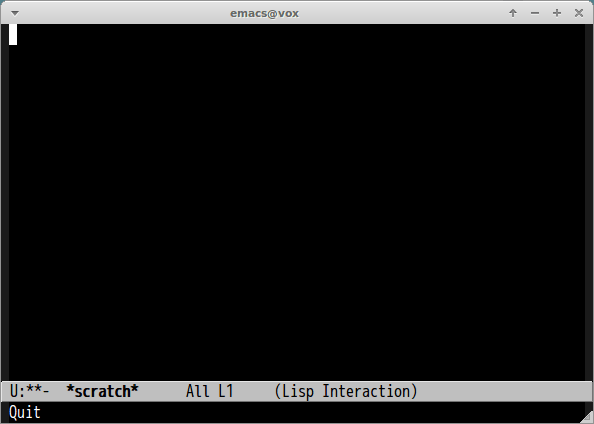

# maven-search.el

Inspired by https://github.com/koron/maven-search

## Introduction

Search maven artifacts in Emacs

## Screenshot

## Requirements

- Emacs 24 or higher

## Basic Usage

#### `(maven-search keyword)`

Search keyword and show **ID** and **LatestVersion**.
